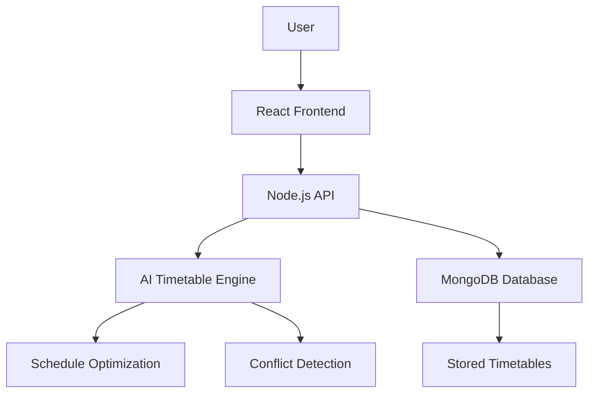
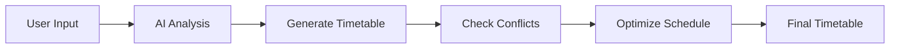
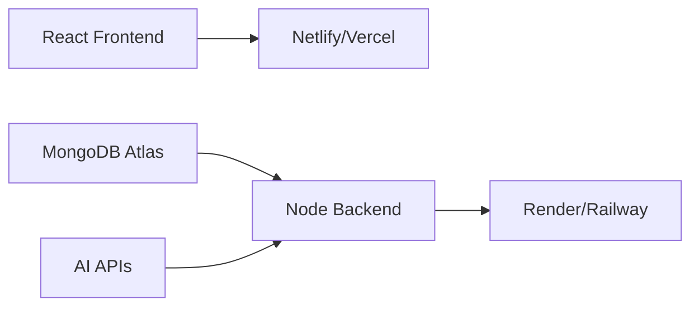

# 🧞 TIME TABLE GENIE

### AI-Powered Smart Timetable Generator

> An intelligent productivity platform that automatically generates optimized schedules for students, teachers, and institutions using AI.

---

# 🚀 Project Overview

**TIME TABLE GENIE** is a modern AI-powered scheduling platform designed to automate and simplify timetable creation. The application intelligently generates optimized schedules based on user availability, subjects, faculty timing, classroom allocation, priorities, and workload balancing.

The platform focuses on:

* Smart timetable generation
* Conflict-free scheduling
* Drag-and-drop customization
* AI recommendations
* Responsive UI/UX
* Real-time timetable updates
* Cloud database integration

---

# 🌟 Features

## 🎯 Core Features

* AI Generated Timetables
* Faculty & Subject Management
* Classroom Allocation
* Smart Conflict Detection
* Drag & Drop Timetable Editor
* Personalized Student Schedules
* Real-Time Updates
* Dark/Light Mode
* PDF Export & Printing
* Attendance & Analytics Integration

## 🤖 AI Features

* Smart Schedule Optimization
* Productivity-Based Time Allocation
* Break Time Suggestions
* Workload Balancing
* Automatic Clash Resolution
* Adaptive Routine Suggestions

---

# 🛠️ Tech Stack

| Frontend      | Backend    | Database | Deployment |
| ------------- | ---------- | -------- | ---------- |
| React.js      | Node.js    | MongoDB  | Netlify    |
| Tailwind CSS  | Express.js | Firebase | Render     |
| Framer Motion | JWT Auth   | Mongoose | Netlify    |

---

# 📂 Repository Structure

```bash
TIME-TABLE-GENIE/
│
├── client/
│   ├── public/
│   ├── src/
│   │   ├── components/
│   │   ├── pages/
│   │   ├── layouts/
│   │   ├── assets/
│   │   ├── animations/
│   │   ├── hooks/
│   │   ├── context/
│   │   ├── utils/
│   │   └── App.jsx
│   └── package.json
│
├── server/
│   ├── controllers/
│   ├── routes/
│   ├── middleware/
│   ├── models/
│   ├── config/
│   ├── services/
│   ├── ai-engine/
│   └── server.js
│
├── diagrams/
├── screenshots/
├── docs/
├── README.md
└── package.json
```

---

# 🎨 Hero Banner Idea


### Tagline

> “Create Smart Schedules in Seconds with AI.”

---

# 🧠 System Architecture



---

# 📊 Workflow Diagram



---

# 🖼️ Suggested Screenshots Section

## 📱 Dashboard UI


---

## 🧞 AI Timetable Generator


---

## 📅 Smart Timetable Preview


---

# 🔥 Why TIME TABLE GENIE?

✅ Saves Hours of Manual Work
✅ Eliminates Scheduling Conflicts
✅ Improves Productivity
✅ Smart AI Recommendations
✅ Professional & Modern Interface
✅ Scalable for Schools & Colleges

---

# 📦 Installation Guide

## Clone Repository

```bash
git clone https://github.com/yourusername/time-table-genie.git
```

## Install Dependencies

```bash
cd time-table-genie
npm install
```

## Start Frontend

```bash
cd client
npm run dev
```

## Start Backend

```bash
cd server
npm run start
```

---

# 🔐 Environment Variables

Create a `.env` file:

```env
MONGO_URI=your_mongodb_url
JWT_SECRET=your_secret_key
OPENAI_API_KEY=your_api_key
PORT=5000
```

---

# 🧪 API Endpoints

| Method | Endpoint                  | Description        |
| ------ | ------------------------- | ------------------ |
| POST   | /api/auth/login           | User Login         |
| POST   | /api/auth/register        | User Register      |
| POST   | /api/timetable/generate   | Generate Timetable |
| GET    | /api/timetable/all        | Fetch Timetables   |
| DELETE | /api/timetable/delete/:id | Delete Timetable   |

---

# 🎯 Future Scope

* Mobile App Version
* Voice-Based AI Scheduling
* AI Productivity Tracking
* Calendar Sync
* WhatsApp Notifications
* College ERP Integration
* Faculty Analytics Dashboard

---

# 📸 Professional GitHub README Preview

## ✨ Badges

```md


```

---

# 💡 UI/UX Design Inspiration

## Recommended Design Style

* Glassmorphism
* Modern Dashboard Layout
* Purple + Blue Gradient Theme
* Animated Cards
* Floating AI Elements
* Clean Typography
* 3D Illustrations

---

# 🧑‍💻 Team Details

| Name          | Role                 |
| ------------- | -------------------- |
| Manan Walekar | Full Stack Developer |
| Abhay Gaur    | Data Analytics       |
| Project Guide | Mentor               |

---

# 📈 Project Outcome

The system significantly reduces manual scheduling efforts while improving timetable accuracy and productivity. The AI-powered approach creates efficient schedules in seconds and adapts dynamically to user needs.

---

# 🌐 Deployment Links

## Frontend

```bash
https://time-table-genie.netlify.app
```

## Backend

```bash
https://time-table-genie-api.onrender.com
```

---

# ⭐ GitHub Repository Optimization Tips

## Add These Sections

* Demo GIFs
* Screenshots Folder
* Architecture Diagrams
* Live Demo Link
* Feature Highlights
* Installation Video
* API Documentation
* Contribution Guide
* License

---

# 🧞 Attractive Repository Description

> TIME TABLE GENIE is an AI-powered smart scheduling platform that generates optimized and conflict-free timetables using modern web technologies and intelligent algorithms.

---

# 📜 License

MIT License © 2026 TIME TABLE GENIE

---

# 📷 Demo Screenshots

## 🏠 Landing Page

```txt
┌────────────────────────────────────────────┐
│ TIME TABLE GENIE                          │
│ Smart AI Timetable Generator              │
│                                            │
│ [ Generate Schedule ] [ Explore Features ]│
│                                            │
│  ✨ AI Powered Scheduling                  │
│  📅 Smart Routine Planner                  │
│  ⚡ Conflict-Free Timetables               │
└────────────────────────────────────────────┘
```

---

## 📊 Dashboard Screen

```txt
┌────────────────────────────────────────────┐
│ Dashboard                                  │
├────────────────────────────────────────────┤
│ Total Subjects: 8                          │
│ Weekly Hours: 42                           │
│ AI Efficiency Score: 95%                   │
├────────────────────────────────────────────┤
│ Monday Schedule                            │
│ 09:00 - DSA                                │
│ 11:00 - DBMS                               │
│ 01:00 - AI/ML                              │
└────────────────────────────────────────────┘
```

---

## 🤖 AI Generator Screen

```txt
┌────────────────────────────────────────────┐
│ AI Timetable Generator                     │
├────────────────────────────────────────────┤
│ Subjects       : 6                         │
│ Study Hours    : 5/day                     │
│ Break Priority : Balanced                  │
│ Focus Mode     : Productivity              │
│                                            │
│ [ Generate Smart Timetable ]               │
└────────────────────────────────────────────┘
```

---

## 📅 Smart Timetable UI

```txt
┌──────────┬──────────┬──────────┬──────────┐
│ Time     │ Monday   │ Tuesday  │ Wednesday│
├──────────┼──────────┼──────────┼──────────┤
│ 09:00 AM │ DSA      │ DBMS     │ AI/ML    │
│ 11:00 AM │ CN       │ DSA      │ React    │
│ 01:00 PM │ React    │ AI/ML    │ CN       │
└──────────┴──────────┴──────────┴──────────┘
```

---

# 🎨 Modern UI Components

## Included UI Sections

* Animated Hero Section
* AI Chat Assistant
* Timetable Cards
* Analytics Dashboard
* Smart Calendar
* Notification Panel
* Dark/Light Mode
* Floating Action Buttons
* Responsive Navbar

---

# ⚙️ Frontend Pages

```bash
/pages
│
├── Home.jsx
├── Login.jsx
├── Register.jsx
├── Dashboard.jsx
├── Timetable.jsx
├── AIPlanner.jsx
├── Analytics.jsx
├── Settings.jsx
└── Profile.jsx
```

---

# 🧠 AI Timetable Logic

## AI Scheduling Algorithm

```javascript
function generateTimetable(subjects, hours) {
  const optimizedSchedule = [];

  subjects.forEach((subject, index) => {
    optimizedSchedule.push({
      subject,
      duration: hours[index],
      priority: "High",
      optimized: true,
    });
  });

  return optimizedSchedule;
}
```

---

# 📦 Recommended NPM Packages

```bash
npm install react-router-dom
npm install axios
npm install mongoose
npm install framer-motion
npm install react-icons
npm install react-big-calendar
npm install jwt-decode
npm install bcryptjs
npm install dotenv
```

---

# 🌈 Recommended Color Palette

| Purpose    | Color   |
| ---------- | ------- |
| Primary    | #7B61FF |
| Secondary  | #5CE1E6 |
| Background | #0F172A |
| Card UI    | #1E293B |
| Accent     | #9333EA |

---

# 🧾 Complete README Structure

```md
# TIME TABLE GENIE
## Features
## Screenshots
## Tech Stack
## Installation
## Environment Variables
## API Documentation
## Deployment
## Contributors
## Future Scope
## License
```

---

# 🧩 Database Schema Example

```javascript
const timetableSchema = new mongoose.Schema({
  title: String,
  subjects: Array,
  generatedByAI: Boolean,
  createdAt: {
    type: Date,
    default: Date.now,
  },
});
```

---

# 📈 Analytics Features

* Study Time Tracking
* Productivity Insights
* Subject Performance Analysis
* AI Suggestions
* Attendance Prediction
* Weekly Reports

---

# ☁️ Deployment Architecture



---

# 🏆 Best Repository Practices

✅ Add proper commit messages
✅ Use clean folder structure
✅ Include screenshots folder
✅ Add live deployment links
✅ Add contribution guide
✅ Include responsive UI previews
✅ Optimize README with badges

---

# ❤️ Final Note

TIME TABLE GENIE is a modern AI-powered productivity platform that combines intelligent scheduling, beautiful UI/UX, and automation to simplify academic planning.

The repository is designed to look professional, attractive, startup-ready, and portfolio-worthy for recruiters, colleges, and GitHub visitors.
